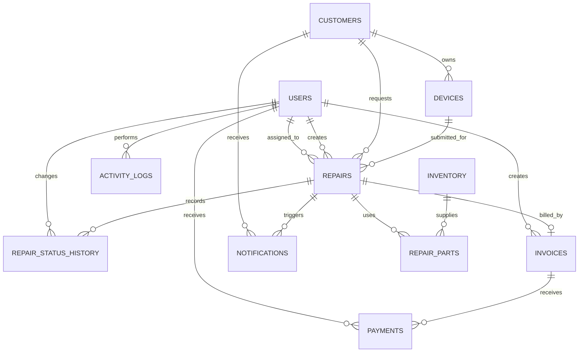

# Entity Relationship Diagram

The following Mermaid diagram documents the database relationships.

## Main entity purpose

- **users**: Administrator, receptionist, and technician accounts.
- **customers**: Customer identity and contact information.
- **devices**: Customer-owned phones submitted for repair.
- **repairs**: Repair tickets and the current workflow state.
- **repair_status_history**: Audit trail of repair progress.
- **inventory**: Spare-parts stock and pricing.
- **repair_parts**: Parts consumed by each repair.
- **invoices**: One invoice per repair.
- **payments**: One or more payments against an invoice.
- **notifications**: Customer communication records.
- **settings**: Repair-center configuration.
- **activity_logs**: Security and operational audit trail.
